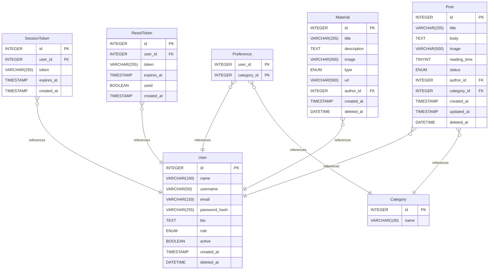
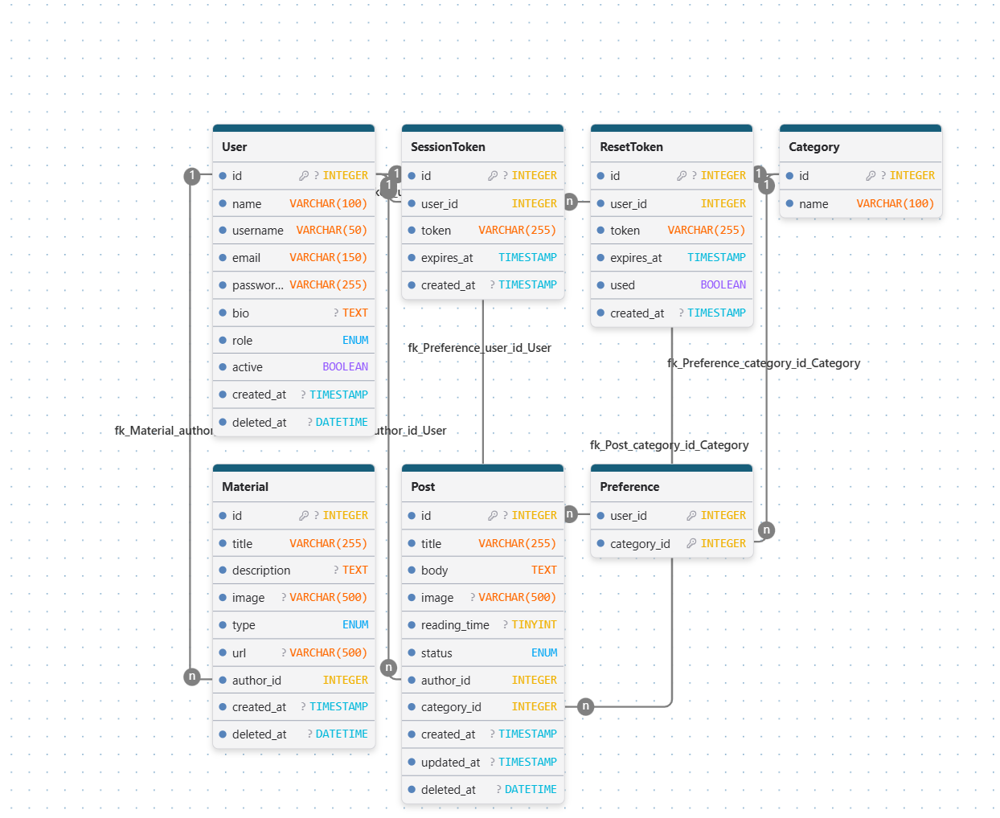

# Diagrama

```mermaid
erDiagram
    SessionToken }o--|| User : references
    ResetToken }o--|| User : references
    Preference }o--|| User : references
    Preference }o--|| Category : references
    Post }o--|| User : references
    Post }o--|| Category : references
    Material }o--|| User : references

    User {
        INTEGER id PK
        VARCHAR(100) name
        VARCHAR(50) username
        VARCHAR(150) email
        VARCHAR(255) password_hash
        TEXT bio
        ENUM role
        BOOLEAN active
        TIMESTAMP created_at
        DATETIME deleted_at
    }

    SessionToken {
        INTEGER id PK
        INTEGER user_id FK
        VARCHAR(255) token
        TIMESTAMP expires_at
        TIMESTAMP created_at
    }

    ResetToken {
        INTEGER id PK
        INTEGER user_id FK
        VARCHAR(255) token
        TIMESTAMP expires_at
        BOOLEAN used
        TIMESTAMP created_at
    }

    Category {
        INTEGER id PK
        VARCHAR(100) name
    }

    Preference {
        INTEGER user_id PK
        INTEGER category_id PK
    }

    Post {
        INTEGER id PK
        VARCHAR(255) title
        TEXT body
        VARCHAR(500) image
        TINYINT reading_time
        ENUM status
        INTEGER author_id FK
        INTEGER category_id FK
        TIMESTAMP created_at
        TIMESTAMP updated_at
        DATETIME deleted_at
    }

    Material {
        INTEGER id PK
        VARCHAR(255) title
        TEXT description
        VARCHAR(500) image
        ENUM type
        VARCHAR(500) url
        INTEGER author_id FK
        TIMESTAMP created_at
        DATETIME deleted_at
    }
```

---
Imagem:

