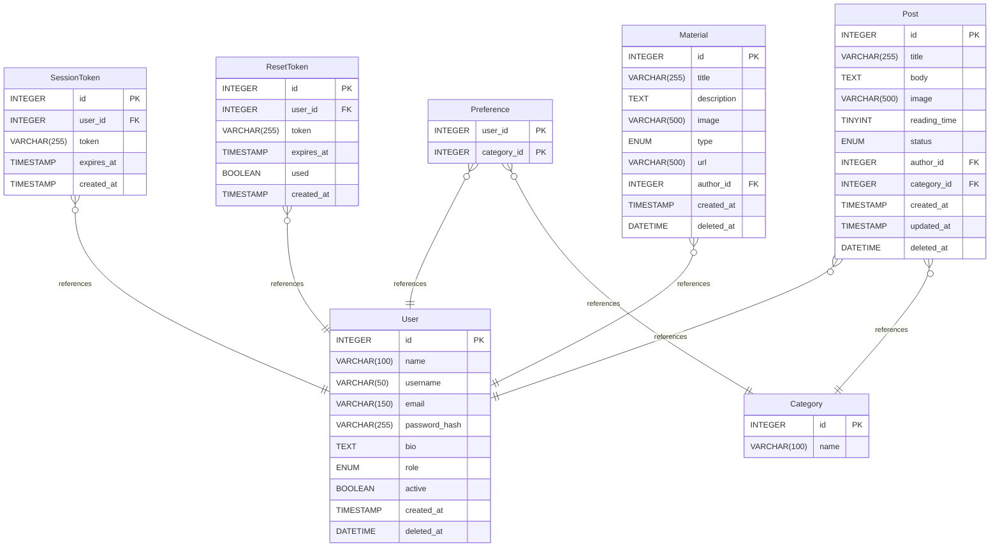

# Diagrama - Sophia

## Sumário

- [Diagrama - Sophia](#diagrama---sophia)
  - [Sumário](#sumário)
  - [Introdução](#introdução)
    - [Tipo de banco](#tipo-de-banco)
  - [Estrutura das tabelas](#estrutura-das-tabelas)
    - [User](#user)
      - [Enums](#enums)
        - [role](#role)
    - [SessionToken](#sessiontoken)
    - [ResetToken](#resettoken)
    - [Category](#category)
    - [Preference](#preference)
    - [Post](#post)
      - [Enums](#enums-1)
        - [status](#status)
    - [Material](#material)
      - [Enums](#enums-2)
        - [type](#type)
  - [Relacionamentos](#relacionamentos)
  - [Diagrama do banco](#diagrama-do-banco)

## Introdução

### Tipo de banco

- **Sistema de banco de dados:** MySQL

## Estrutura das tabelas

### User

| Nome              | Tipo         | Configurações                    | Referências | Nota |
| ----------------- | ------------ | -------------------------------- | ----------- | ---- |
| **id**            | INTEGER      | 🔑 PK, not null, autoincrement   |             |      |
| **name**          | VARCHAR(100) | not null                         |             |      |
| **username**      | VARCHAR(50)  | not null, unique                 |             |      |
| **email**         | VARCHAR(150) | not null, unique                 |             |      |
| **password_hash** | VARCHAR(255) | not null                         |             |      |
| **bio**           | TEXT         | null                             |             |      |
| **role**          | ENUM         | not null, default: user          |             |      |
| **active**        | BOOLEAN      | not null, default: true          |             |      |
| **created_at**    | TIMESTAMP    | not null, default: CURRENT_TIMESTAMP |         |      |
| **deleted_at**    | DATETIME     | null, default: NULL              |             |      |

#### Enums

##### role

- user
- admin

### SessionToken

| Nome           | Tipo         | Configurações                        | Referências                  | Nota |
| -------------- | ------------ | ------------------------------------ | ---------------------------- | ---- |
| **id**         | INTEGER      | 🔑 PK, not null, autoincrement       |                              |      |
| **user_id**    | INTEGER      | not null                             | fk_SessionToken_user_id_User |      |
| **token**      | VARCHAR(255) | not null                             |                              |      |
| **expires_at** | TIMESTAMP    | not null                             |                              |      |
| **created_at** | TIMESTAMP    | not null, default: CURRENT_TIMESTAMP |                              |      |

### ResetToken

| Nome           | Tipo         | Configurações                        | Referências                | Nota |
| -------------- | ------------ | ------------------------------------ | -------------------------- | ---- |
| **id**         | INTEGER      | 🔑 PK, not null, autoincrement       |                            |      |
| **user_id**    | INTEGER      | not null                             | fk_ResetToken_user_id_User |      |
| **token**      | VARCHAR(255) | not null                             |                            |      |
| **expires_at** | TIMESTAMP    | not null                             |                            |      |
| **used**       | BOOLEAN      | not null, default: false             |                            |      |
| **created_at** | TIMESTAMP    | not null, default: CURRENT_TIMESTAMP |                            |      |

### Category

| Nome     | Tipo         | Configurações                  | Referências | Nota |
| -------- | ------------ | ------------------------------ | ----------- | ---- |
| **id**   | INTEGER      | 🔑 PK, not null, autoincrement |             |      |
| **name** | VARCHAR(100) | not null, unique               |             |      |

### Preference

Chave primária composta: (`user_id`, `category_id`) — impede que o mesmo usuário adicione a mesma categoria duas vezes.

| Nome            | Tipo    | Configurações        | Referências                        | Nota |
| --------------- | ------- | -------------------- | ---------------------------------- | ---- |
| **user_id**     | INTEGER | 🔑 PK (composta), not null | fk_Preference_user_id_User   |      |
| **category_id** | INTEGER | 🔑 PK (composta), not null | fk_Preference_category_id_Category | |

### Post

| Nome             | Tipo         | Configurações                        | Referências                  | Nota |
| ---------------- | ------------ | ------------------------------------ | ---------------------------- | ---- |
| **id**           | INTEGER      | 🔑 PK, not null, autoincrement       |                              |      |
| **title**        | VARCHAR(255) | not null                             |                              |      |
| **body**         | TEXT         | not null                             |                              |      |
| **image**        | VARCHAR(500) | null                                 |                              |      |
| **reading_time** | TINYINT      | null                                 |                              |      |
| **status**       | ENUM         | not null, default: published         |                              |      |
| **author_id**    | INTEGER      | not null                             | fk_Post_author_id_User       |      |
| **category_id**  | INTEGER      | not null                             | fk_Post_category_id_Category |      |
| **created_at**   | TIMESTAMP    | not null, default: CURRENT_TIMESTAMP |                              |      |
| **updated_at**   | TIMESTAMP    | not null, default: CURRENT_TIMESTAMP |                              |      |
| **deleted_at**   | DATETIME     | null, default: NULL                  |                              |      |

#### Enums

##### status

- published
- archived

### Material

| Nome            | Tipo         | Configurações                        | Referências                | Nota |
| --------------- | ------------ | ------------------------------------ | -------------------------- | ---- |
| **id**          | INTEGER      | 🔑 PK, not null, autoincrement       |                            |      |
| **title**       | VARCHAR(255) | not null                             |                            |      |
| **description** | TEXT         | null                                 |                            |      |
| **image**       | VARCHAR(500) | null                                 |                            |      |
| **type**        | ENUM         | not null                             |                            |      |
| **url**         | VARCHAR(500) | null                                 |                            |      |
| **author_id**   | INTEGER      | not null                             | fk_Material_author_id_User |      |
| **created_at**  | TIMESTAMP    | not null, default: CURRENT_TIMESTAMP |                            |      |
| **deleted_at**  | DATETIME     | null, default: NULL                  |                            |      |

#### Enums

##### type

- pdf
- link
- book

## Relacionamentos

- **SessionToken para User**: muitos_para_um
- **ResetToken para User**: muitos_para_um
- **Preference para User**: muitos_para_um
- **Preference para Category**: muitos_para_um
- **Post para User**: muitos_para_um
- **Post para Category**: muitos_para_um
- **Material para User**: muitos_para_um

## Diagrama do banco

